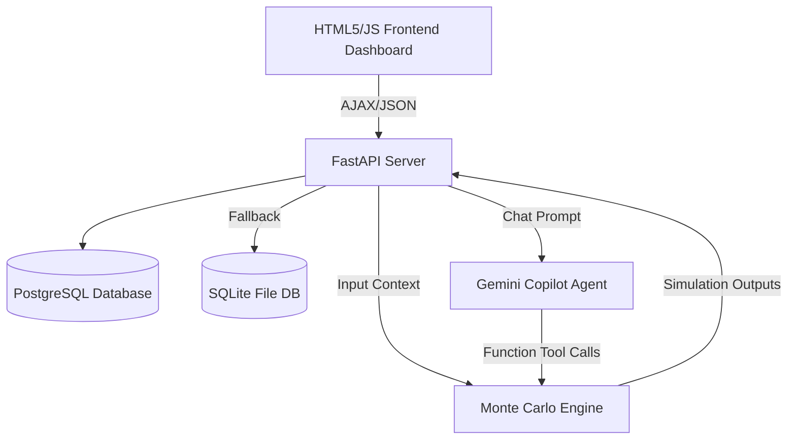

# 🔮 FinTwin — Your Financial Future, Simulated

FinTwin is a sophisticated, probabilistic **Personal Financial Digital Twin** and **Monte Carlo Engine** designed to replace deterministic financial planning. Instead of predicting a single linear trajectory, FinTwin simulates thousands of possible futures, mapping out risk boundaries, Value-at-Risk (VaR), Conditional Value-at-Risk (CVaR), and retirement ruin probabilities.

---

## 1. Mathematical Simulation Engine

FinTwin supports three distinct multivariate market models and four decumulation rules:

### A. Market Return Models
1. **Parametric Monte Carlo**:
   Generates joint log-normal asset returns using the Cholesky decomposition of the covariance matrix:
   $$\mathbf{R}_t = \boldsymbol{\mu} + \mathbf{L} \mathbf{Z}_t$$
   where $\boldsymbol{\mu}$ is the expected returns vector, $\mathbf{L}$ is the lower triangular Cholesky factor of the correlation matrix ($\mathbf{\Sigma} = \mathbf{L}\mathbf{L}^T$), and $\mathbf{Z}_t \sim \mathcal{N}(0, \mathbf{I})$ is a vector of independent standard normals.
   
2. **Historical Bootstrap**:
   Resamples vector return observations directly from the joint Indian market dataset (Nifty 50, Gold, Debt, FD) spanning 2010–2024. This preserves the non-normal skewness, kurtosis, and empirical correlations without making parametric assumptions.

3. **Markov Regime-Switching**:
   Transitions the market state through five distinct regimes: $\mathcal{S}_t \in \{\text{BULL}, \text{NORMAL}, \text{BEAR}, \text{CRISIS}, \text{RECOVERY}\}$ using a transition probability matrix $\mathbf{P}$:
   $$P_{ij} = \mathbb{P}(\mathcal{S}_{t+1} = j \mid \mathcal{S}_t = i)$$
   
   During a **CRISIS** regime:
   - Asset correlations are dynamically spiked to $+0.60$ to simulate systemic market contagions.
   - Volatilities are scaled up, and expected returns are shifted downwards.

### B. Decumulation & Withdrawal Guardrails
- **Fixed & Inflation-Adjusted**: Withdrawals grow strictly by the simulated annual inflation rate.
- **Percentage (4% Rule)**: Fixed percentage of the portfolio value is withdrawn annually.
- **Guyton-Klinger Guardrails**:
  Dynamic rules-based withdrawal adjustment:
  - **Capital Preservation Rule**: If the current withdrawal rate exceeds the initial rate by $20\%$ due to market crashes, withdrawals are cut by $10\%$.
  - **Prosperity Rule**: If the current withdrawal rate drops $20\%$ below the initial target due to bull runs, withdrawals are increased by $10\%$ to avoid unnecessary wealth hoarding.

### C. Monthly Amortization & Debt Loop
Rather than treating debt as a simple annual outflow, FinTwin executes a monthly inner loop that calculates amortization:
$$EMI = P \times \frac{r_m(1+r_m)^N}{(1+r_m)^N - 1}$$
Where $r_m$ is the monthly interest rate, and $N$ is the remaining tenure in months. Variable rate loans are subjected to random volatility shocks, tracking interest rate sensitivity.

---

## 2. Software Architecture

FinTwin is designed as a modular, decoupled digital twin system:



### Components:
- **Frontend SPA**: A Tailwind CSS dashboard utilizing Chart.js to render net worth percentiles (p5, p50, p95), stress-test scenario inputs, and Pareto optimization profiles.
- **FastAPI Core**: Serves the REST API, manages CRUD operations, and handles failovers.
- **PostgreSQL Layer**: Persists user profiles, target goals, scheduled life events, and outstanding liabilities (resiliently falling back to SQLite if offline).
- **Gemini Copilot (google-genai)**: A personal financial copilot equipped with native tool calling configurations (`run_simulation_tool`, `run_stress_test_tool`) to verify calculations from the simulator before replying.

---

## 3. Running Locally

### Backend Setup
1. Navigate to backend:
   ```bash
   cd backend
   pip install -r requirements.txt
   ```
2. Start the dev server:
   ```bash
   python3 -m uvicorn app.main:app --host 127.0.0.1 --port 8000
   ```

### Running Tests
Execute the unit and mathematical verification tests using:
```bash
pytest backend/tests/
```
